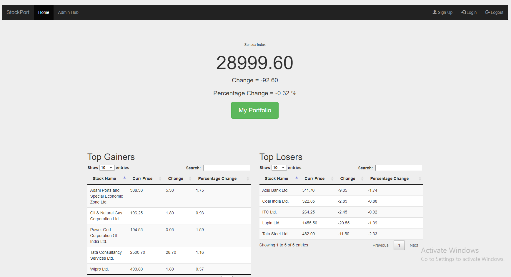
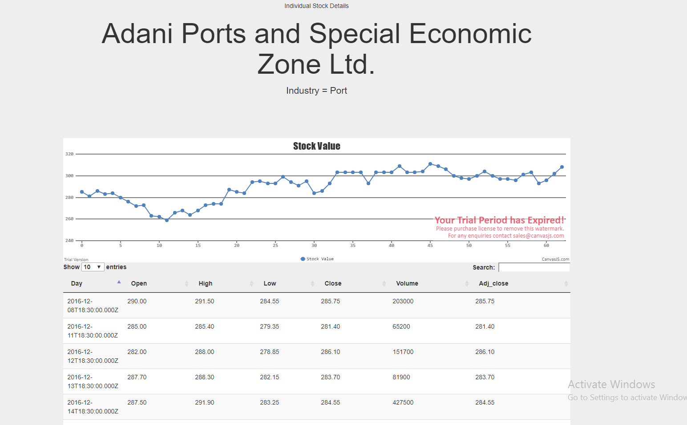

# Stocx
A personal portfolio manager and stock market portal

## Description

This project is a database application for displaying and managing stock market related data. The motivation
was to provide any common trader without any technical knowledge with an easy way to manage
his portfolio. It is a website that keeps track of the daily trading data of the BSE Index - Sensex and its
constituent stocks. A general user can check the details of the listed stocks as well as their daily trading
records over the past three months.
The website also serves as a personal portfolio manager for registered users. Users can enter records of
their transactions over the available Sensex stocks. The website queries all the transaction and presents a
summary of user’s portfolio to him along with the net profit or loss on each stock and the total portfolio.

## Getting started
Prerequisites: NodeJs and npm
* Clone the repository 
* In the cloned folder, run `npm install`
* Run `npm start`
* Go to a browser and open `localhost:3000`

More details on functionality, views, backend logic and design process are available in the [design document](design_doc.pdf)

## Quick Tour

### Home page of the site:

### Individual stock view:

